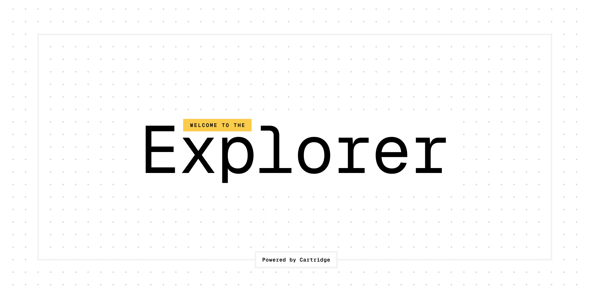

# Explorer

A developer oriented and stateless explorer for Starknet.

## Using for your Starknet network

1. Clone the repository

```bash
git clone https://github.com/cartridge-gg/explorer.git
```

2. Install dependencies

We use bun to install the dependencies but you can use any other package manager.

```bash
bun install
```

3. Create a `.env` file and use the `.env.example` as a template.

```bash
VITE_RPC_URL=YOUR_RPC_URL
VITE_CHAIN_ID=YOUR_CHAIN_ID
VITE_IS_EMBEDDED=true
```

4. Run the app

```bash
bun run dev
```
